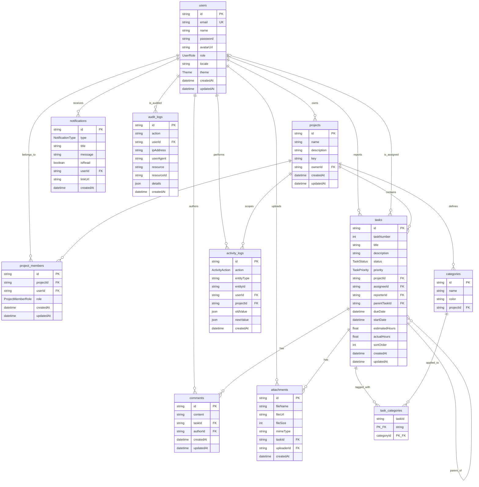

# ER図

`prisma/schema.prisma` および `docs/spec.md` の「DB 設計」セクションに対応する ER 図です。Mermaid の `erDiagram` 記法で記述しており、GitHub 上ではそのままレンダリングされます。

## エンティティ一覧

| #   | テーブル          | 概要                                           |
| --- | ----------------- | ---------------------------------------------- |
| 1   | `users`           | ユーザー（ログイン主体・システム権限）         |
| 2   | `projects`        | プロジェクト（タスクのコンテナ）               |
| 3   | `project_members` | プロジェクト所属メンバーと権限                 |
| 4   | `tasks`           | タスク（サブタスクは自己参照で表現）           |
| 5   | `categories`      | プロジェクト配下のカテゴリ／ラベル             |
| 6   | `task_categories` | タスクとカテゴリの多対多中間テーブル           |
| 7   | `comments`        | タスクに紐づくコメント                         |
| 8   | `attachments`     | タスクに紐づく添付ファイル                     |
| 9   | `activity_logs`   | タスク等エンティティの変更履歴                 |
| 10  | `notifications`   | ユーザー向け通知                               |
| 11  | `audit_logs`      | 管理者操作の監査ログ                           |

## ER 図

## リレーション補足

- `users` 〜 `tasks` は 2 種類のリレーションを持ちます。`reporterId` は必須（1:N）、`assigneeId` は任意（0..1:N）。
- `tasks` の `parentTaskId` による自己参照でサブタスクを表現します（親タスク削除時は子タスクも Cascade 削除）。
- `tasks` 〜 `categories` の多対多は `task_categories` を中間テーブルとして実現し、複合主キー `(taskId, categoryId)` を持ちます。
- `project_members` は `(projectId, userId)` に複合 UNIQUE 制約があり、同一ユーザーが同一プロジェクトに複数登録されないことを保証します。
- `tasks` は `(projectId, taskNumber)` に複合 UNIQUE 制約を持ち、プロジェクト単位で連番が一意になります。
- 削除時の挙動（`onDelete`）は以下の通りです。
  - `projects` 削除時: `project_members` / `tasks` / `categories` / `activity_logs` を Cascade 削除。
  - `tasks` 削除時: `comments` / `attachments` / `task_categories` / サブタスクを Cascade 削除。
  - `categories` 削除時: `task_categories` を Cascade 削除。
  - `users` 削除時: `tasks.assigneeId` は SetNull、`notifications` / `project_members` は Cascade 削除。

## 参考

- Prisma スキーマ: [`prisma/schema.prisma`](../prisma/schema.prisma)
- DB 設計詳細: [`docs/spec.md`](./spec.md) の「DB 設計」セクション
- Mermaid `erDiagram` 構文: <https://mermaid.js.org/syntax/entityRelationshipDiagram.html>
